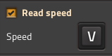
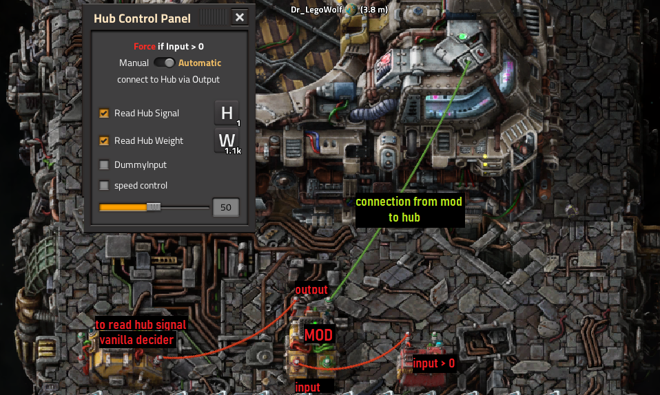

# 🚀 Space Platform Hub Control Combinator

A **Factorio mod** that adds a **decider-combinator-like** entity to precisely control and monitor the **space platform hub** via the circuit network.

---

## 🔧 How to Use

1. **Connect the mod’s output to the space platform hub.**
2. **Connect any signal input to the mod's input** (e.g., from a constant combinator or another logic source).
3. To **read the hub's status**, connect a decider combinator (or anything else) to the mod’s **output**  
   
4. To **control the hub's speed**, make sure the **"Read speed"** checkbox in the hub is checked.  
   

---

## ✅ Features & Advantages

### 1. **Full Hub Control**
- Hardlock the **hub between automatic/manual mode** using any circuit signal input.
- If the **signal > 0**, the **mod GUI takes control** of the hub state.

### 2. **Hub State Monitoring**
- **Read real-time hub status via signals**:
  - **`H1`** → Hub is in automatic mode and moving  
  - **`H0`** → Otherwise

### 3. **Precision Speed Locking**
- Set a **target speed (e.g., 30 km/s)** and the mod will hard-lock the hub to it once reached.

### 4. **Dummy Input Toggle**
- Use the **GUI's dummy input checkbox** to toggle hub automatic/manual **without needing a circuit signal**.

---

## ⚠️ Known Limitations / Cons

### 1. **Speed Control Affects Hub State Reading**
- If the **"Speed Control"** checkbox is **ticked** and the platform's speed drops to **`0 km/s` or lower**,  
  the **hub state signal will read as `H0`** — even if the hub is still in **"automatic"** mode.
- This means that when the **platform stops at a station** (i.e., speed = `0` or `-10`), the mod **will report it as not moving**.
- ➤ **If you need perfect hub state reading, avoid enabling Speed Control.**

---
